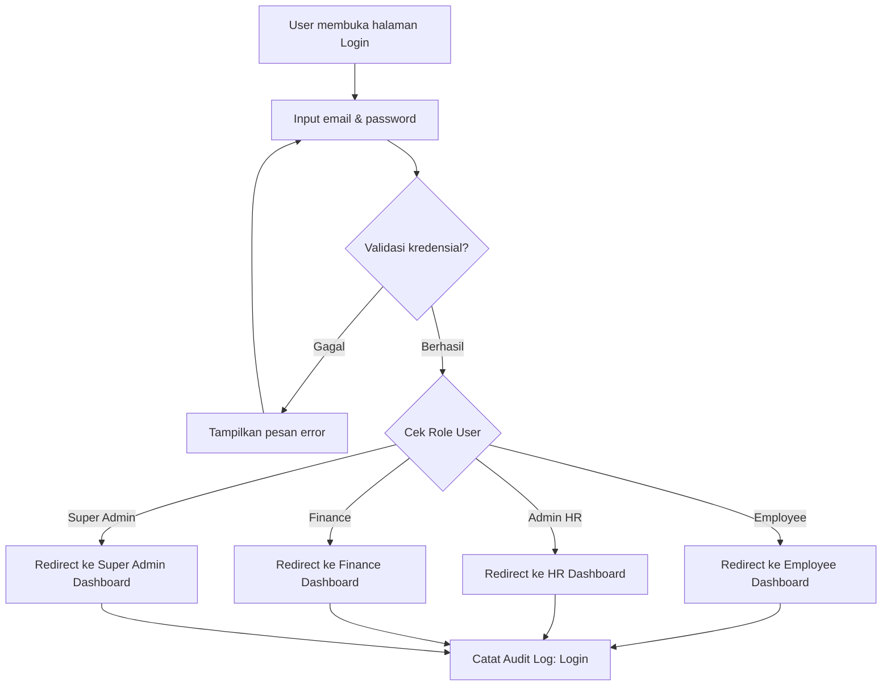
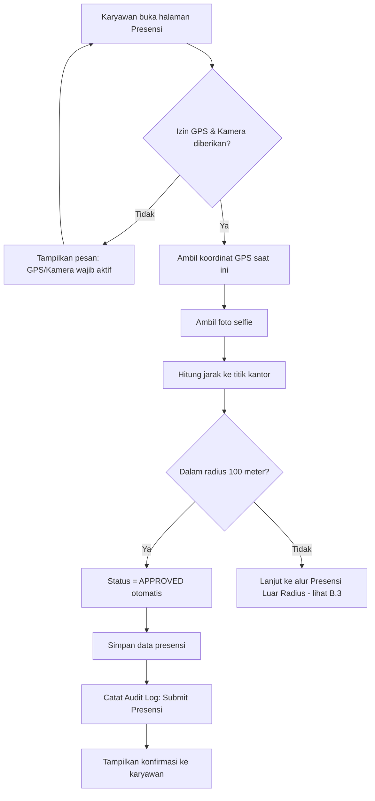
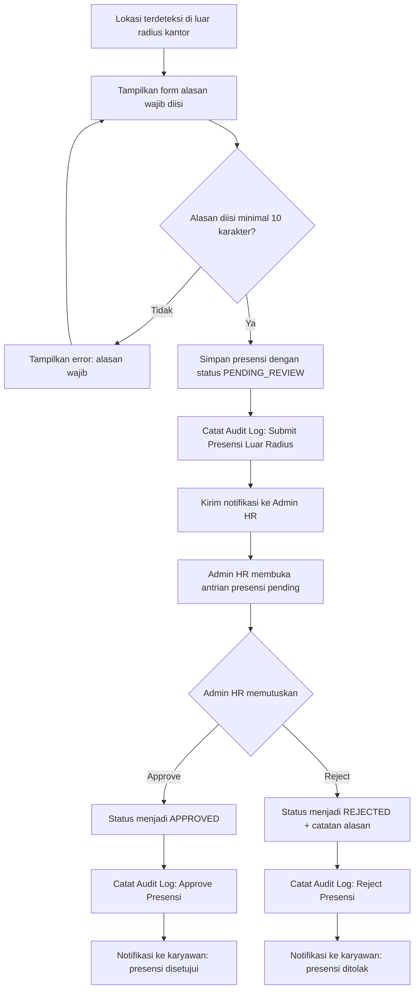
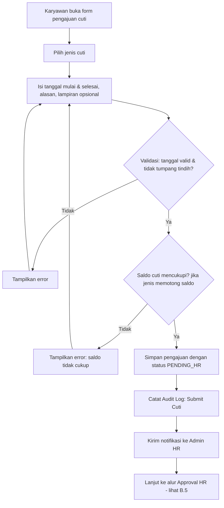
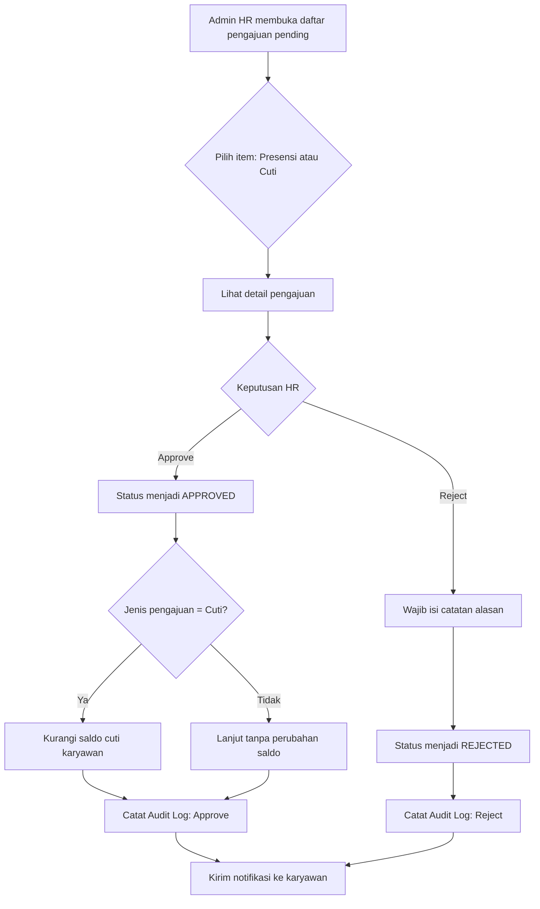
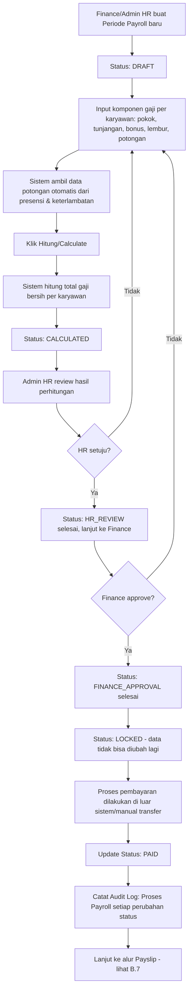
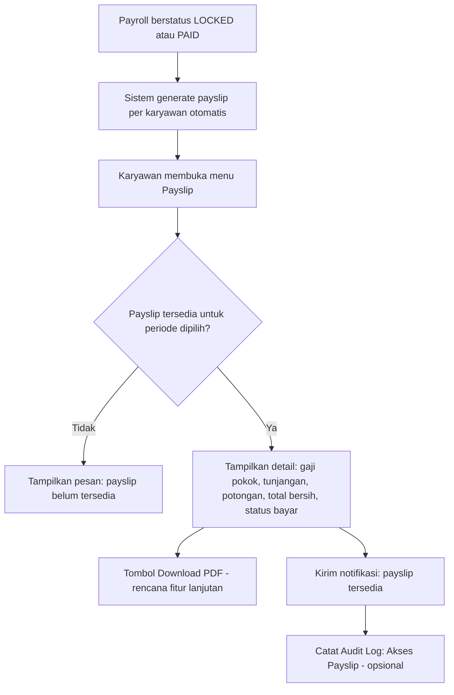
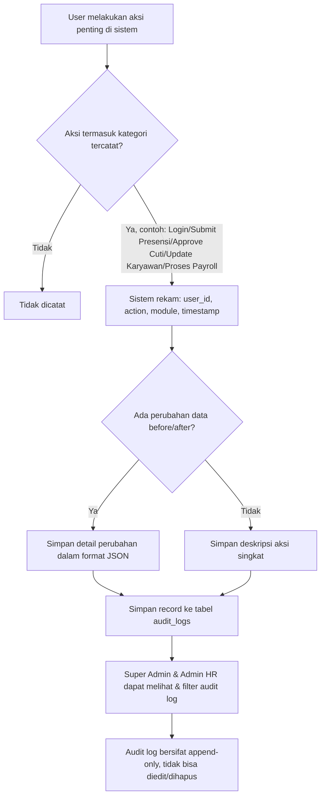

# HRIS Mobile App — Dokumen Lengkap Pengembangan

## A. PRD (Product Requirements Document)

### A.1 Ringkasan Produk

**HRIS Mobile App** adalah aplikasi web mobile-first berbasis Laravel yang digunakan untuk mengelola seluruh proses HR harian dalam satu sistem: presensi berbasis GPS dan selfie, pengajuan izin/cuti, approval HR, payroll sederhana, payslip digital, manajemen data karyawan, laporan, dan audit log. Aplikasi dirancang agar bisa diakses langsung dari browser HP karyawan (mobile-first responsive), dengan opsi dikembangkan menjadi PWA agar terasa seperti aplikasi native (bisa di-install, bekerja offline-ready untuk beberapa fitur).

Aplikasi ini menyatukan tiga kebutuhan yang biasanya terpisah di banyak perusahaan kecil-menengah:
- **Karyawan**: presensi, cuti, payslip, profil.
- **HR**: approval presensi & cuti, manajemen data karyawan, laporan, audit log.
- **Finance**: payroll, perhitungan gaji, status pembayaran.

### A.2 Latar Belakang Masalah

Banyak perusahaan skala kecil-menengah masih mengelola presensi dengan kertas/Excel, approval cuti lewat chat/WhatsApp, dan payroll dihitung manual. Ini menimbulkan masalah:

1. **Presensi tidak akurat** — karyawan bisa titip absen, tidak ada bukti lokasi/wajah.
2. **Proses approval tidak terlacak** — tidak ada riwayat siapa approve, kapan, dan alasan apa.
3. **Payroll rawan human error** — perhitungan manual rentan salah hitung tunjangan, potongan, lembur.
4. **Tidak ada audit trail** — sulit menelusuri siapa mengubah data apa dan kapan, terutama untuk kebutuhan kepatuhan internal.
5. **Data karyawan tersebar** — di Excel terpisah-pisah, tidak terpusat dan tidak real-time.

HRIS Mobile App hadir untuk menyatukan proses ini dalam satu sistem berbasis role, dengan validasi otomatis (radius GPS, status approval berjenjang) sehingga mengurangi kecurangan dan mempercepat proses administrasi HR.

### A.3 Tujuan Aplikasi

1. Menyediakan sistem presensi yang sulit dimanipulasi (GPS + selfie + radius kantor).
2. Mempercepat proses pengajuan dan approval cuti/izin secara digital.
3. Menyederhanakan perhitungan payroll dengan komponen gaji yang terstruktur.
4. Memberi karyawan akses mandiri (self-service) untuk melihat status presensi, cuti, dan payslip.
5. Memberi HR dan Finance dashboard yang jelas untuk mengambil keputusan approval dan pembayaran.
6. Mencatat seluruh aktivitas penting ke dalam audit log untuk transparansi dan akuntabilitas.
7. Dibangun dengan arsitektur yang scalable (Laravel + MySQL) agar mudah dikembangkan ke fitur lanjutan (export, PDF, PWA, notifikasi push).

### A.4 Target Pengguna

| Target | Deskripsi |
|---|---|
| Karyawan (Employee) | Seluruh staf perusahaan yang melakukan presensi harian dan mengajukan cuti/izin |
| Admin HR | Tim HR yang mengelola data karyawan, approval presensi/cuti, dan laporan |
| Finance | Tim keuangan yang memproses payroll dan memastikan status pembayaran |
| Super Admin | Pemilik sistem/IT internal yang mengelola seluruh data, role, dan konfigurasi sistem |

Perusahaan target: skala kecil-menengah (10–500 karyawan), satu atau beberapa kantor cabang, belum memiliki sistem HR digital terintegrasi.

### A.5 Role dan Permission

| Role | Hak Akses Utama |
|---|---|
| **Employee** | Check-in/out presensi, ajukan cuti/izin, lihat riwayat presensi & cuti, lihat payslip, edit profil terbatas |
| **Admin HR** | Semua hak Employee + kelola data karyawan (CRUD), approve/reject presensi pending, approve/reject cuti, lihat & buat laporan, lihat audit log, kelola periode payroll (tahap awal) |
| **Finance** | Lihat data payroll, input/edit komponen gaji, proses perhitungan payroll, approval tahap finance, lihat laporan payroll, lihat payslip semua karyawan |
| **Super Admin** | Semua hak di atas + kelola user & role, kelola departemen/jabatan, kelola konfigurasi sistem (radius kantor, jenis cuti, dll), akses penuh audit log |

**Prinsip permission**: setiap route dan setiap aksi (approve, edit, delete) divalidasi di middleware dan policy berdasarkan role yang login. Tidak ada akses langsung via URL tanpa validasi role.

### A.6 Daftar Fitur Utama

1. Authentication & Role-based Access Control
2. Dashboard per Role
3. Employee Management (CRUD data karyawan)
4. Attendance / Presensi (GPS + Selfie + Radius)
5. Leave & Permission (Cuti & Izin)
6. Payroll (perhitungan gaji per periode)
7. Payslip (slip gaji digital)
8. Report / Laporan (presensi, cuti, payroll)
9. Notification (in-app)
10. Audit Log

### A.7 User Stories

**Employee**
- Sebagai karyawan, saya ingin check-in dengan GPS dan selfie agar presensi saya tervalidasi otomatis.
- Sebagai karyawan, saya ingin mengisi alasan jika saya check-in di luar radius kantor, agar tetap tercatat meski perlu review HR.
- Sebagai karyawan, saya ingin mengajukan cuti dengan memilih jenis cuti dan melampirkan dokumen pendukung jika perlu.
- Sebagai karyawan, saya ingin melihat sisa saldo cuti saya sebelum mengajukan.
- Sebagai karyawan, saya ingin melihat status pengajuan cuti saya (pending/approved/rejected).
- Sebagai karyawan, saya ingin melihat dan (nantinya) mengunduh payslip saya per periode.
- Sebagai karyawan, saya ingin mendapat notifikasi saat pengajuan saya disetujui/ditolak.

**Admin HR**
- Sebagai admin HR, saya ingin melihat daftar presensi yang berstatus pending review agar bisa segera memprosesnya.
- Sebagai admin HR, saya ingin approve/reject presensi dan cuti beserta catatan alasan.
- Sebagai admin HR, saya ingin mengelola data karyawan (tambah, edit, nonaktifkan) dengan mudah.
- Sebagai admin HR, saya ingin melihat laporan rekap presensi dan cuti per departemen/periode.
- Sebagai admin HR, saya ingin melihat audit log untuk menelusuri perubahan data penting.

**Finance**
- Sebagai finance, saya ingin membuat periode payroll baru dan menginput komponen gaji per karyawan.
- Sebagai finance, saya ingin sistem menghitung otomatis total gaji bersih berdasarkan komponen yang diinput.
- Sebagai finance, saya ingin mengunci (lock) payroll setelah final agar tidak bisa diubah lagi.
- Sebagai finance, saya ingin melihat status pembayaran tiap periode payroll.

**Super Admin**
- Sebagai super admin, saya ingin mengelola seluruh user dan role agar akses sistem terkontrol.
- Sebagai super admin, saya ingin mengatur radius kantor dan jenis cuti yang tersedia di sistem.
- Sebagai super admin, saya ingin memiliki akses penuh ke seluruh modul untuk keperluan audit/maintenance.

### A.8 Business Rules

1. **Presensi**
   - Check-in/out wajib mengaktifkan GPS dan kamera (selfie). Jika salah satu ditolak, presensi tidak bisa disubmit.
   - Radius kantor default **100 meter** dari titik koordinat kantor (dapat dikonfigurasi Super Admin).
   - Jika lokasi dalam radius → status presensi otomatis **APPROVED**.
   - Jika lokasi di luar radius → karyawan **wajib mengisi alasan**, status menjadi **PENDING_REVIEW**, dan masuk ke antrian approval HR.
   - Satu karyawan hanya bisa memiliki satu check-in dan satu check-out aktif per hari.
   - Check-out hanya bisa dilakukan setelah check-in pada hari yang sama.

2. **Cuti/Izin**
   - Status awal pengajuan selalu **PENDING_HR**.
   - Jenis cuti: Cuti Tahunan, Sakit, Izin Pribadi, Cuti Khusus (masing-masing bisa punya aturan saldo berbeda; Sakit & Cuti Khusus bisa tidak memotong saldo tergantung kebijakan perusahaan — dikonfigurasi Super Admin).
   - Tanggal selesai tidak boleh lebih awal dari tanggal mulai.
   - Saldo cuti tahunan berkurang otomatis **hanya setelah disetujui HR**, bukan saat pengajuan dibuat (saldo "dicadangkan" sebagai pending, dikurangi permanen saat approved).
   - Karyawan tidak bisa mengajukan cuti baru jika ada pengajuan lain yang tanggalnya tumpang tindih dan masih pending/approved.
   - Jika ditolak, saldo cuti tidak berkurang.

3. **Payroll**
   - Payroll dibuat per periode (misal: bulanan), satu periode untuk satu rentang tanggal.
   - Alur status: **DRAFT → CALCULATED → HR_REVIEW → FINANCE_APPROVAL → LOCKED → PAID**.
   - Setelah status **LOCKED**, data komponen gaji tidak bisa diubah lagi (read-only), kecuali oleh Super Admin dengan log perubahan khusus.
   - Payslip hanya bisa diakses karyawan setelah payroll berstatus **LOCKED** atau **PAID**.
   - Perhitungan total gaji bersih = Gaji Pokok + Tunjangan + Bonus + Lembur − Potongan − Potongan Keterlambatan − Potongan Absensi − Pajak/BPJS (jika diaktifkan).

4. **Approval umum**
   - Setiap aksi approve/reject wajib dicatat siapa approver-nya dan waktu approve.
   - Reject wajib disertai alasan/catatan.

5. **Role & Akses**
   - Semua endpoint backend divalidasi ulang di server (tidak hanya hide di UI), menggunakan middleware role + policy.

### A.9 Validasi Penting

| Area | Validasi |
|---|---|
| Login | Email valid, password minimal 8 karakter, rate limit percobaan login (anti brute-force) |
| Presensi | GPS aktif (lat/long terisi), foto selfie wajib (file image, max 5MB), alasan wajib jika di luar radius (min 10 karakter) |
| Cuti | Tanggal mulai ≤ tanggal selesai, jenis cuti wajib dipilih, alasan wajib diisi, lampiran opsional (pdf/jpg/png, max 5MB), saldo cuti cukup (untuk jenis yang memotong saldo) |
| Data Karyawan | Email unik, NIK unik, nomor HP format valid, field wajib (nama, email, NIK, jabatan, departemen, tanggal masuk) tidak boleh kosong |
| Payroll | Komponen gaji berupa angka ≥ 0, periode tidak boleh duplikat untuk rentang tanggal yang sama, tidak bisa edit jika status LOCKED/PAID |
| Upload File | Validasi tipe file dan ukuran maksimal di sisi server, bukan hanya di frontend |

### A.10 Data yang Disimpan

- Data identitas & akun: nama, email, password (hashed), role.
- Data karyawan: NIK, jabatan, departemen, tanggal masuk, status kerja, no. HP, alamat, foto profil, nomor rekening bank.
- Data presensi: timestamp check-in/out, koordinat GPS, foto selfie, status, alasan (jika di luar radius), approver.
- Data cuti: jenis, tanggal mulai/selesai, alasan, lampiran, status, approver, catatan approval.
- Data saldo cuti per karyawan per tahun.
- Data payroll: periode, komponen gaji per karyawan, status, riwayat approval.
- Data payslip: snapshot hasil payroll per karyawan per periode.
- Data notifikasi: judul, pesan, status dibaca/belum, relasi ke modul terkait.
- Data audit log: user, aksi, modul, waktu, detail perubahan (before/after jika relevan).

### A.11 Non-Functional Requirements

1. **Performance**: halaman utama (dashboard, presensi) harus dapat dimuat < 2 detik pada koneksi 4G normal.
2. **Responsiveness**: seluruh halaman wajib mobile-first, dapat digunakan nyaman di layar 360px–414px lebar.
3. **Availability**: target uptime backend minimal 99% (untuk skala internal perusahaan).
4. **Scalability**: struktur database dan kode harus mendukung penambahan jumlah karyawan tanpa perombakan besar.
5. **Maintainability**: kode mengikuti struktur Laravel standar (MVC + Service layer) agar mudah dikembangkan tim lain.
6. **Usability**: alur presensi maksimal 3 langkah (buka halaman → izinkan GPS/kamera → submit).
7. **Compatibility**: berjalan baik di browser mobile utama (Chrome Android, Safari iOS).
8. **PWA-ready**: struktur frontend disiapkan agar mudah ditambahkan manifest.json & service worker di tahap lanjutan.

### A.12 Security Requirements

1. Password disimpan dengan hashing (bcrypt/argon2, default Laravel).
2. Autentikasi menggunakan session/Laravel Breeze, dengan opsi token (Sanctum) jika diperlukan akses API mobile native ke depan.
3. CSRF protection aktif di semua form.
4. Validasi role dilakukan di middleware **dan** policy (defense in depth), bukan hanya di Blade view.
5. File upload (selfie, lampiran cuti) divalidasi tipe & ukuran, disimpan di storage privat (tidak public langsung), diakses lewat route terproteksi.
6. Rate limiting pada endpoint login dan endpoint submit presensi/cuti untuk mencegah abuse.
7. Audit log tidak dapat dihapus/diedit oleh role mana pun (append-only).
8. Data sensitif (nomor rekening, NIK) ditampilkan dengan masking parsial di tampilan list, full hanya di halaman detail dengan akses terbatas.
9. HTTPS wajib digunakan di environment production (untuk keamanan GPS & foto yang dikirim).
10. Logout otomatis (session expired) setelah periode tidak aktif tertentu (dikonfigurasi).

### A.13 MVP Scope

**Termasuk MVP (wajib ada di rilis pertama):**
- Login, logout, role-based dashboard & proteksi halaman.
- Employee management dasar (CRUD).
- Presensi GPS + selfie + radius + approval pending.
- Pengajuan & approval cuti/izin + saldo cuti.
- Payroll dasar (input komponen, hitung otomatis, alur status sampai PAID).
- Payslip (lihat di web, tombol download PDF boleh placeholder/disabled dulu).
- Laporan dasar (rekap presensi, cuti, payroll dalam tabel, filter tanggal/departemen).
- Notifikasi in-app sederhana (list/toast).
- Audit log dasar untuk aksi-aksi penting yang disebutkan.

**Tidak termasuk MVP (future enhancement):**
- Export CSV/Excel.
- Download payslip dalam format PDF (real generation).
- Push notification (web push/mobile native).
- Integrasi payroll dengan pajak otomatis (PPh21) dan BPJS resmi.
- Multi-kantor dengan radius berbeda per cabang.
- Offline mode penuh (PWA caching presensi saat offline).
- Aplikasi native (Android/iOS) terpisah.

### A.14 Future Enhancement

1. Export laporan ke CSV/Excel dan generate payslip PDF otomatis (mis. menggunakan package `barryvdh/laravel-dompdf` atau `maatwebsite/excel`).
2. Push notification via web push (PWA) atau integrasi Firebase Cloud Messaging.
3. Integrasi perhitungan pajak PPh21 dan BPJS Kesehatan/Ketenagakerjaan otomatis.
4. Multi-cabang/multi-lokasi dengan radius kantor berbeda per cabang.
5. Approval berjenjang (multi-level approval) untuk cuti dengan durasi panjang.
6. Integrasi absensi fingerprint/RFID sebagai alternatif GPS+selfie.
7. Mode offline untuk presensi (data tersimpan lokal, sync saat online kembali — fitur khas PWA).
8. Dashboard analitik lanjutan (grafik tren kehadiran, turnover, dsb).
9. Integrasi kalender (Google Calendar) untuk jadwal cuti tim.
10. Self-service slip gaji + riwayat pajak tahunan (semacam e-Bukti Potong).
## B. Flowchart (Mermaid)

### B.1 Alur Login dan Role Redirect



### B.2 Alur Presensi GPS + Selfie



### B.3 Alur Presensi di Luar Radius



### B.4 Alur Pengajuan Cuti/Izin



### B.5 Alur Approval HR (Presensi & Cuti)



### B.6 Alur Payroll



### B.7 Alur Payslip



### B.8 Alur Audit Log


## C. Database Design (Laravel + MySQL)

### C.1 Daftar Tabel

1. `users` — akun login & role
2. `employees` — data detail karyawan (1:1 dengan users)
3. `departments` — daftar departemen
4. `positions` — daftar jabatan
5. `attendance_records` — data presensi harian
6. `leave_types` — jenis cuti/izin (referensi, agar fleksibel dikonfigurasi)
7. `leave_requests` — pengajuan cuti/izin
8. `leave_balances` — saldo cuti per karyawan per tahun
9. `payroll_periods` — periode payroll
10. `payroll_records` — detail komponen gaji per karyawan per periode
11. `payslips` — snapshot payslip final
12. `notifications` — notifikasi in-app
13. `audit_logs` — log aktivitas sistem
14. `office_locations` — (pendukung) titik koordinat kantor & radius, agar tidak hardcode

### C.2 Field Penting Setiap Tabel

**users**
- id (PK)
- name
- email (unique)
- password (hashed)
- role (enum: employee, admin_hr, finance, super_admin)
- is_active (boolean)
- last_login_at
- timestamps

**employees**
- id (PK)
- user_id (FK → users.id, unique)
- nik (unique)
- department_id (FK → departments.id)
- position_id (FK → positions.id)
- join_date
- employment_status (enum: active, probation, resigned, terminated)
- phone_number
- address (text)
- photo_path
- bank_account_number
- bank_name
- timestamps

**departments**
- id (PK)
- name
- description
- timestamps

**positions**
- id (PK)
- name
- department_id (FK, nullable jika jabatan lintas departemen)
- timestamps

**office_locations**
- id (PK)
- name
- latitude
- longitude
- radius_meters (default 100)
- is_active
- timestamps

**attendance_records**
- id (PK)
- employee_id (FK → employees.id)
- attendance_date (date)
- check_in_time (datetime, nullable)
- check_in_lat, check_in_lng
- check_in_photo_path
- check_out_time (datetime, nullable)
- check_out_lat, check_out_lng
- check_out_photo_path
- status (enum: APPROVED, PENDING_REVIEW, REJECTED)
- out_of_radius_reason (text, nullable)
- approved_by (FK → users.id, nullable)
- approved_at (nullable)
- approval_note (text, nullable)
- timestamps

**leave_types**
- id (PK)
- name (mis: Cuti Tahunan, Sakit, Izin Pribadi, Cuti Khusus)
- deducts_balance (boolean)
- timestamps

**leave_requests**
- id (PK)
- employee_id (FK → employees.id)
- leave_type_id (FK → leave_types.id)
- start_date
- end_date
- total_days (computed/stored)
- reason (text)
- attachment_path (nullable)
- status (enum: PENDING_HR, APPROVED, REJECTED)
- approved_by (FK → users.id, nullable)
- approved_at (nullable)
- approval_note (text, nullable)
- timestamps

**leave_balances**
- id (PK)
- employee_id (FK → employees.id)
- leave_type_id (FK → leave_types.id)
- year (int)
- total_quota (decimal)
- used (decimal)
- remaining (decimal, bisa computed: total_quota - used)
- timestamps
- unique index: (employee_id, leave_type_id, year)

**payroll_periods**
- id (PK)
- name (mis: "Payroll Juni 2026")
- start_date
- end_date
- status (enum: DRAFT, CALCULATED, HR_REVIEW, FINANCE_APPROVAL, LOCKED, PAID)
- created_by (FK → users.id)
- timestamps

**payroll_records**
- id (PK)
- payroll_period_id (FK → payroll_periods.id)
- employee_id (FK → employees.id)
- basic_salary (decimal)
- allowance (decimal, default 0)
- bonus (decimal, default 0)
- overtime (decimal, default 0)
- deduction (decimal, default 0)
- late_deduction (decimal, default 0)
- attendance_deduction (decimal, default 0)
- tax_bpjs (decimal, default 0, nullable jika belum dipakai)
- net_salary (decimal, computed saat calculate)
- timestamps
- unique index: (payroll_period_id, employee_id)

**payslips**
- id (PK)
- payroll_record_id (FK → payroll_records.id)
- employee_id (FK → employees.id)
- payroll_period_id (FK → payroll_periods.id)
- snapshot_data (json — salinan komponen gaji final, agar tidak berubah meski payroll_records di-update di masa depan)
- payment_status (enum: UNPAID, PAID)
- paid_at (nullable)
- timestamps

**notifications**
- id (PK)
- user_id (FK → users.id)
- title
- message
- type (enum: attendance, leave, payroll, general)
- reference_id (nullable, id record terkait)
- reference_type (nullable, nama model terkait)
- is_read (boolean, default false)
- timestamps

**audit_logs**
- id (PK)
- user_id (FK → users.id, nullable jika sistem)
- action (string, mis: "login", "submit_attendance", "approve_leave")
- module (string, mis: "attendance", "leave", "payroll", "employee")
- description (text)
- changes (json, nullable — berisi before/after)
- ip_address (nullable)
- created_at (tanpa updated_at, karena append-only)

### C.3 Relasi Antar Tabel

- `users` 1—1 `employees` (satu user punya satu data employee, kecuali role HR/Finance/Super Admin yang mungkin tidak punya data employee jika mereka bukan karyawan operasional — opsional)
- `departments` 1—N `employees`
- `positions` 1—N `employees`
- `departments` 1—N `positions` (opsional, tergantung kebutuhan)
- `employees` 1—N `attendance_records`
- `employees` 1—N `leave_requests`
- `leave_types` 1—N `leave_requests`
- `employees` 1—N `leave_balances`
- `leave_types` 1—N `leave_balances`
- `payroll_periods` 1—N `payroll_records`
- `employees` 1—N `payroll_records`
- `payroll_records` 1—1 `payslips`
- `users` 1—N `notifications`
- `users` 1—N `audit_logs`
- `office_locations` digunakan sebagai referensi saat menghitung radius presensi (tidak perlu FK langsung ke attendance_records, cukup dipakai saat proses hitung jarak)

### C.4 Status Enum yang Digunakan

| Tabel | Field | Nilai Enum |
|---|---|---|
| users | role | employee, admin_hr, finance, super_admin |
| employees | employment_status | active, probation, resigned, terminated |
| attendance_records | status | APPROVED, PENDING_REVIEW, REJECTED |
| leave_requests | status | PENDING_HR, APPROVED, REJECTED |
| payroll_periods | status | DRAFT, CALCULATED, HR_REVIEW, FINANCE_APPROVAL, LOCKED, PAID |
| payslips | payment_status | UNPAID, PAID |
| notifications | type | attendance, leave, payroll, general |

### C.5 Saran Migration Laravel

Urutan migration disarankan mengikuti dependensi FK (tabel referensi dulu, baru tabel yang punya FK ke sana):

```
1. create_users_table (default Laravel, tambah kolom role, is_active, last_login_at)
2. create_departments_table
3. create_positions_table
4. create_office_locations_table
5. create_employees_table (FK ke users, departments, positions)
6. create_leave_types_table
7. create_attendance_records_table (FK ke employees, users untuk approved_by)
8. create_leave_requests_table (FK ke employees, leave_types, users)
9. create_leave_balances_table (FK ke employees, leave_types)
10. create_payroll_periods_table (FK ke users untuk created_by)
11. create_payroll_records_table (FK ke payroll_periods, employees)
12. create_payslips_table (FK ke payroll_records, employees, payroll_periods)
13. create_notifications_table (FK ke users)
14. create_audit_logs_table (FK ke users, nullable)
```

Contoh potongan migration untuk `attendance_records`:

```php
Schema::create('attendance_records', function (Blueprint $table) {
    $table->id();
    $table->foreignId('employee_id')->constrained()->cascadeOnDelete();
    $table->date('attendance_date');
    $table->dateTime('check_in_time')->nullable();
    $table->decimal('check_in_lat', 10, 7)->nullable();
    $table->decimal('check_in_lng', 10, 7)->nullable();
    $table->string('check_in_photo_path')->nullable();
    $table->dateTime('check_out_time')->nullable();
    $table->decimal('check_out_lat', 10, 7)->nullable();
    $table->decimal('check_out_lng', 10, 7)->nullable();
    $table->string('check_out_photo_path')->nullable();
    $table->enum('status', ['APPROVED', 'PENDING_REVIEW', 'REJECTED'])->default('APPROVED');
    $table->text('out_of_radius_reason')->nullable();
    $table->foreignId('approved_by')->nullable()->constrained('users')->nullOnDelete();
    $table->dateTime('approved_at')->nullable();
    $table->text('approval_note')->nullable();
    $table->timestamps();

    $table->unique(['employee_id', 'attendance_date']);
});
```

Catatan: gunakan `foreignId()->constrained()` untuk relasi standar, tambahkan index pada kolom yang sering difilter (`status`, `attendance_date`, `payroll_period_id`) agar query laporan tetap cepat saat data sudah besar.
## D. Laravel Development Plan

### D.1 Struktur Folder yang Disarankan

```
app/
├── Http/
│   ├── Controllers/
│   │   ├── Auth/                  (dari Breeze)
│   │   ├── Employee/
│   │   │   ├── DashboardController.php
│   │   │   ├── AttendanceController.php
│   │   │   ├── LeaveRequestController.php
│   │   │   └── PayslipController.php
│   │   ├── HR/
│   │   │   ├── DashboardController.php
│   │   │   ├── EmployeeManagementController.php
│   │   │   ├── AttendanceApprovalController.php
│   │   │   ├── LeaveApprovalController.php
│   │   │   └── ReportController.php
│   │   ├── Finance/
│   │   │   ├── DashboardController.php
│   │   │   └── PayrollController.php
│   │   ├── SuperAdmin/
│   │   │   ├── UserManagementController.php
│   │   │   ├── DepartmentController.php
│   │   │   ├── PositionController.php
│   │   │   ├── OfficeLocationController.php
│   │   │   └── AuditLogController.php
│   │   └── NotificationController.php
│   ├── Middleware/
│   │   ├── RoleMiddleware.php
│   │   └── CheckActiveUser.php
│   └── Requests/
│       ├── AttendanceCheckInRequest.php
│       ├── LeaveRequestStoreRequest.php
│       ├── EmployeeStoreRequest.php
│       └── PayrollRecordRequest.php
├── Models/
│   ├── User.php
│   ├── Employee.php
│   ├── Department.php
│   ├── Position.php
│   ├── OfficeLocation.php
│   ├── AttendanceRecord.php
│   ├── LeaveType.php
│   ├── LeaveRequest.php
│   ├── LeaveBalance.php
│   ├── PayrollPeriod.php
│   ├── PayrollRecord.php
│   ├── Payslip.php
│   ├── Notification.php
│   └── AuditLog.php
├── Services/
│   ├── AttendanceService.php       (hitung radius, validasi presensi)
│   ├── LeaveService.php            (validasi saldo, alur approval)
│   ├── PayrollService.php          (perhitungan gaji bersih)
│   ├── NotificationService.php
│   └── AuditLogService.php
├── Policies/
│   ├── AttendanceRecordPolicy.php
│   ├── LeaveRequestPolicy.php
│   ├── PayrollRecordPolicy.php
│   └── EmployeePolicy.php
resources/
├── views/
│   ├── layouts/
│   │   ├── app.blade.php
│   │   └── navigation-bottom.blade.php
│   ├── employee/
│   ├── hr/
│   ├── finance/
│   ├── super-admin/
│   └── components/
routes/
├── web.php
├── employee.php
├── hr.php
├── finance.php
└── super-admin.php
```

### D.2 Model yang Dibutuhkan

`User`, `Employee`, `Department`, `Position`, `OfficeLocation`, `AttendanceRecord`, `LeaveType`, `LeaveRequest`, `LeaveBalance`, `PayrollPeriod`, `PayrollRecord`, `Payslip`, `Notification`, `AuditLog`.

Relasi penting di model (contoh):

```php
// Employee.php
public function user() { return $this->belongsTo(User::class); }
public function department() { return $this->belongsTo(Department::class); }
public function position() { return $this->belongsTo(Position::class); }
public function attendanceRecords() { return $this->hasMany(AttendanceRecord::class); }
public function leaveRequests() { return $this->hasMany(LeaveRequest::class); }
public function leaveBalances() { return $this->hasMany(LeaveBalance::class); }
```

### D.3 Controller yang Dibutuhkan

- **AttendanceController** — form check-in/out, submit, riwayat presensi karyawan.
- **AttendanceApprovalController** (HR) — list pending, approve/reject.
- **LeaveRequestController** — form pengajuan, riwayat cuti karyawan.
- **LeaveApprovalController** (HR) — list pending, approve/reject, update saldo.
- **EmployeeManagementController** (HR/Super Admin) — CRUD data karyawan.
- **PayrollController** (Finance) — CRUD periode, input komponen, proses hitung, ubah status.
- **PayslipController** — tampil payslip karyawan.
- **ReportController** (HR) — rekap presensi/cuti/payroll dengan filter.
- **NotificationController** — list notifikasi, mark as read.
- **AuditLogController** (Super Admin/HR) — list & filter audit log.
- **DashboardController** per role (atau satu controller dengan method berbeda per role).

### D.4 Middleware Role Access

```php
// app/Http/Middleware/RoleMiddleware.php
public function handle($request, Closure $next, ...$roles)
{
    if (!$request->user() || !in_array($request->user()->role, $roles)) {
        abort(403, 'Akses ditolak.');
    }
    return $next($request);
}
```

Daftarkan alias di `bootstrap/app.php` (Laravel 11+) atau `Kernel.php` (Laravel ≤10):

```php
'role' => \App\Http\Middleware\RoleMiddleware::class,
```

Pemakaian di route:

```php
Route::middleware(['auth', 'role:admin_hr,super_admin'])->group(function () {
    // route khusus HR & Super Admin
});
```

### D.5 Route Group Berdasarkan Role

```php
// routes/web.php
Route::middleware('auth')->group(function () {
    Route::get('/dashboard', [DashboardController::class, 'index'])->name('dashboard');
    Route::get('/notifications', [NotificationController::class, 'index']);

    // Employee — semua role yang punya data employee bisa akses
    Route::middleware('role:employee,admin_hr,finance,super_admin')->group(function () {
        Route::get('/attendance', [AttendanceController::class, 'index']);
        Route::post('/attendance/check-in', [AttendanceController::class, 'checkIn']);
        Route::post('/attendance/check-out', [AttendanceController::class, 'checkOut']);
        Route::resource('/leave-requests', LeaveRequestController::class)->only(['index','create','store','show']);
        Route::get('/payslips', [PayslipController::class, 'index']);
    });

    // HR
    Route::middleware('role:admin_hr,super_admin')->prefix('hr')->group(function () {
        Route::resource('/employees', EmployeeManagementController::class);
        Route::get('/attendance-approval', [AttendanceApprovalController::class, 'index']);
        Route::post('/attendance-approval/{attendance}', [AttendanceApprovalController::class, 'process']);
        Route::get('/leave-approval', [LeaveApprovalController::class, 'index']);
        Route::post('/leave-approval/{leave}', [LeaveApprovalController::class, 'process']);
        Route::get('/reports', [ReportController::class, 'index']);
    });

    // Finance
    Route::middleware('role:finance,super_admin')->prefix('finance')->group(function () {
        Route::resource('/payroll-periods', PayrollController::class);
        Route::post('/payroll-periods/{period}/calculate', [PayrollController::class, 'calculate']);
        Route::post('/payroll-periods/{period}/status', [PayrollController::class, 'updateStatus']);
    });

    // Super Admin
    Route::middleware('role:super_admin')->prefix('admin')->group(function () {
        Route::resource('/users', UserManagementController::class);
        Route::resource('/departments', DepartmentController::class);
        Route::resource('/positions', PositionController::class);
        Route::resource('/office-locations', OfficeLocationController::class);
        Route::get('/audit-logs', [AuditLogController::class, 'index']);
    });
});
```

### D.6 Service Class yang Diperlukan

- **AttendanceService**: hitung jarak (haversine formula) antara koordinat user dan `office_locations`, tentukan status APPROVED/PENDING_REVIEW, simpan record.
- **LeaveService**: cek tumpang tindih tanggal, cek saldo cuti, proses approve (kurangi saldo) & reject.
- **PayrollService**: hitung `net_salary` dari seluruh komponen, ambil data potongan otomatis dari `attendance_records` (keterlambatan/absen), generate `payslips` saat status LOCKED.
- **NotificationService**: helper `notify($user, $title, $message, $type, $reference)` dipanggil dari service lain.
- **AuditLogService**: helper `log($user, $action, $module, $description, $changes = null)` dipanggil di titik-titik penting (login, submit, approve, update, dsb).

Contoh sederhana perhitungan radius:

```php
// app/Services/AttendanceService.php
public function isWithinRadius(float $lat, float $lng, OfficeLocation $office): bool
{
    $earthRadius = 6371000; // meter
    $dLat = deg2rad($lat - $office->latitude);
    $dLng = deg2rad($lng - $office->longitude);
    $a = sin($dLat/2) ** 2 + cos(deg2rad($office->latitude)) * cos(deg2rad($lat)) * sin($dLng/2) ** 2;
    $distance = $earthRadius * 2 * atan2(sqrt($a), sqrt(1-$a));
    return $distance <= $office->radius_meters;
}
```

### D.7 Validasi Form (Form Request)

- `AttendanceCheckInRequest`: `latitude` required numeric, `longitude` required numeric, `photo` required image max:5120, `reason` required_if luar radius.
- `LeaveRequestStoreRequest`: `leave_type_id` required exists, `start_date` required date, `end_date` required date after_or_equal:start_date, `reason` required min:10, `attachment` nullable file mimes:pdf,jpg,png max:5120.
- `EmployeeStoreRequest`: `name` required, `email` required email unique, `nik` required unique, `department_id` required exists, `position_id` required exists, `join_date` required date, `phone_number` required regex sesuai format.
- `PayrollRecordRequest`: semua komponen gaji `numeric min:0`.

### D.8 File Upload untuk Selfie dan Lampiran

- Simpan di disk privat: `storage/app/private/attendance/` dan `storage/app/private/leave-attachments/`.
- Gunakan `Storage::disk('local')->putFile(...)` agar tidak bisa diakses publik langsung.
- Buat route terproteksi untuk menampilkan file: `GET /files/attendance/{id}` yang mengecek policy sebelum `Storage::response()`.
- Validasi MIME type dan ukuran file di Form Request (server-side), jangan andalkan validasi browser saja.
- Pertimbangkan kompresi gambar selfie (mis. dengan `Intervention/Image`) sebelum disimpan agar storage lebih efisien.

### D.9 Rekomendasi Package Laravel

| Kebutuhan | Package |
|---|---|
| Auth scaffolding | `laravel/breeze` |
| Styling | `tailwindcss` (via Breeze) |
| Role/permission lanjutan (opsional) | `spatie/laravel-permission` |
| Image processing (resize/compress selfie) | `intervention/image` |
| PDF generation (payslip — future) | `barryvdh/laravel-dompdf` |
| Export Excel/CSV (laporan — future) | `maatwebsite/excel` |
| Aktivitas/audit log (alternatif manual) | `spatie/laravel-activitylog` |
| Date handling | `nesbot/carbon` (sudah built-in Laravel) |
| API token untuk pengembangan mobile native ke depan | `laravel/sanctum` |
| PWA support | `laravel-pwa` atau setup manual manifest + service worker |

**Catatan implementasi**: untuk MVP, audit log dan role access bisa dibuat manual (sesuai Service class & Middleware di atas) agar tim lebih memahami alurnya, baru opsional diganti package seperti `spatie/laravel-permission` saat kebutuhan role makin kompleks (multi-permission granular).
## E. Prompt untuk Google Stitch / UI Generator

**Petunjuk pemakaian**: salin setiap blok prompt di bawah ini satu per satu ke Google Stitch (atau UI generator lain seperti Figma AI / v0). Semua prompt sudah mengikuti gaya desain yang sama: mobile-first, clean modern HR dashboard, warna biru/indigo/putih, profesional untuk aplikasi kantor.

**Gaya desain global** (sertakan di setiap prompt jika tool memerlukan konteks ulang):
> Design style: mobile-first, clean and modern HR dashboard, professional and corporate feel, color palette primary indigo/blue (#4F46E5 / #4338CA) with white background and soft gray neutrals, rounded cards with subtle shadow, clear status badges (green=approved, yellow=pending, red=rejected), bottom navigation bar with icons, generous spacing, sans-serif font (Inter or similar).

---

**1. Login**
```
Design a mobile login screen for an HR/HRIS app called "HRIS Mobile App". Include: app logo/name at top, email input field, password input field with show/hide toggle, "Forgot Password" link, primary indigo "Login" button (full width, rounded), subtle footer text "© Company Name". Clean white background, mobile-first layout (390px width), modern corporate style, indigo/blue accent color.
```

**2. Employee Dashboard**
```
Design a mobile dashboard home screen for an employee in an HRIS app. Top section: greeting "Hi, [Name]" with profile photo avatar and notification bell icon. Below: a card showing today's attendance status with a status badge (Approved/Pending/Not yet checked in) and quick check-in/check-out button. Next: a card showing remaining leave balance (e.g. "12 days left"). Next: a card showing latest leave request status with badge. Next: a card showing latest payslip summary with "View Payslip" link. Bottom navigation bar with icons: Home, Attendance, Leave, Payslip, Profile. Style: clean modern HR dashboard, indigo/blue/white color palette, rounded cards with soft shadow, mobile-first 390px width.
```

**3. Attendance Check-in/Check-out**
```
Design a mobile attendance check-in screen for an HRIS app. Show: current date and time at top, a map preview card showing user's current GPS location with a pin, a circular selfie camera capture button/preview below the map, status text showing "Within office radius" or "Outside office radius" with colored indicator (green/red), a conditional text area for "Reason" that appears only when outside radius, large primary indigo "Check In" button at the bottom (full width, rounded). Mobile-first, clean modern HR app style, indigo/blue/white palette.
```

**4. Attendance History**
```
Design a mobile attendance history screen for an HRIS app. Top: filter bar with date range picker and dropdown (This Month/Last Month). Below: a scrollable list of attendance entries, each item as a card showing date, check-in time, check-out time, and a status badge (Approved=green, Pending Review=yellow, Rejected=red). Empty state illustration if no data. Bottom navigation bar present. Style: clean modern HR dashboard, indigo/blue/white, mobile-first 390px width.
```

**5. Leave Request Form**
```
Design a mobile leave/permission request form screen for an HRIS app. Include: header "Request Leave" with back button, dropdown to select leave type (Annual Leave, Sick Leave, Personal Leave, Special Leave), date range picker for start date and end date, a text area for reason, an attachment upload button (optional, shows file name once uploaded), a summary text showing remaining leave balance, primary indigo "Submit Request" button full width at bottom. Mobile-first, clean modern HR app style, indigo/blue/white palette, rounded input fields.
```

**6. Leave History**
```
Design a mobile leave request history screen for an HRIS app. Top: tabs or filter chips (All, Pending, Approved, Rejected). Below: scrollable list of leave request cards, each showing leave type icon, date range, number of days, and a status badge (Pending HR=yellow, Approved=green, Rejected=red). Tapping a card would show detail (just design the list view). Bottom navigation present. Style: clean modern HR dashboard, indigo/blue/white, mobile-first.
```

**7. HR Approval Queue**
```
Design a mobile HR approval queue screen for an HRIS app (used by Admin HR role). Top: tabs to switch between "Attendance Approval" and "Leave Approval", with a count badge showing number of pending items. Below: scrollable list of pending request cards, each showing employee photo/avatar, name, department, request summary (e.g. "Check-in outside radius - 350m" or "Annual Leave - 3 days"), submitted time, and two action buttons "Approve" (green) and "Reject" (red, outline style). Style: clean modern HR dashboard, professional corporate feel, indigo/blue/white palette, mobile-first 390px width.
```

**8. Payroll List**
```
Design a mobile payroll periods list screen for an HRIS app (used by Finance role). Top: header "Payroll" with a "+ New Period" button. Below: list of payroll period cards, each showing period name (e.g. "Payroll June 2026"), date range, total employees count, and a status badge (Draft=gray, Calculated=blue, HR Review=yellow, Finance Approval=orange, Locked=purple, Paid=green). Tapping opens detail (design list view only). Style: clean modern HR dashboard, professional finance feel, indigo/blue/white, mobile-first.
```

**9. Payslip Detail**
```
Design a mobile payslip detail screen for an HRIS app. Header showing employee name, position, and payroll period (e.g. "June 2026"). Below: a clean breakdown table/list showing Basic Salary, Allowance, Bonus, Overtime, then a divider, then Deductions, Late Deduction, Attendance Deduction, then a highlighted total row "Net Salary" in bold indigo. Payment status badge (Paid=green / Unpaid=gray) near the top. A "Download PDF" button (outline style) at the bottom. Style: clean modern, professional payslip document feel within a mobile app, indigo/blue/white palette, mobile-first 390px width.
```

**10. Employee Profile**
```
Design a mobile employee profile screen for an HRIS app. Top: large circular profile photo, employee name, position and department subtitle. Below: a list of info rows with icons (Email, Phone, NIK, Join Date, Address, Bank Account masked e.g. "**** 4521"). An "Edit Profile" button. A "Logout" button at the very bottom (red text, no fill). Bottom navigation present. Style: clean modern HR dashboard, indigo/blue/white palette, mobile-first.
```

**11. Admin HR Dashboard**
```
Design a mobile dashboard home screen for an HR Admin role in an HRIS app. Top: greeting with HR admin name and notification bell. Below: a grid of summary cards (2 columns) showing: Total Employees, Pending Attendance Approvals, Pending Leave Requests, Active Payroll Period. Below that: a quick-access section with buttons "Review Attendance" and "Review Leave Requests" highlighted in indigo. Below: a simple bar chart card showing attendance trend for the week. Bottom navigation bar with icons: Home, Employees, Approvals, Reports, Profile. Style: clean modern HR dashboard, professional corporate feel, indigo/blue/white palette, mobile-first 390px width.
```

**12. Finance Payroll Dashboard**
```
Design a mobile dashboard home screen for a Finance role in an HRIS app. Top: greeting with Finance staff name and notification bell. Below: summary cards showing Current Payroll Period status, Total Employees in Payroll, Total Net Salary Amount, and Payment Status overview (Paid vs Unpaid count). Below: a quick action button "Process Current Payroll" in indigo, full width. Below: a list/card of recent payroll periods with status badges. Bottom navigation bar with icons: Home, Payroll, Reports, Profile. Style: clean modern HR/finance dashboard, professional corporate feel, indigo/blue/white palette, mobile-first 390px width.
```
## F. Acceptance Criteria

### F.1 Authentication & Role Access
- [ ] User dapat login dengan email & password yang valid, dan ditolak jika salah dengan pesan error yang jelas.
- [ ] Setelah login, user diarahkan otomatis ke dashboard sesuai role-nya.
- [ ] User yang mencoba mengakses URL di luar hak role-nya mendapat response 403, bukan ditampilkan halamannya.
- [ ] User dapat logout dan session langsung tidak valid setelahnya (mencoba back browser tidak menampilkan halaman privat).
- [ ] Aktivitas login tercatat di audit log.

### F.2 Dashboard
- [ ] Employee dashboard menampilkan status presensi hari ini, sisa cuti, status pengajuan terbaru, dan ringkasan payslip terakhir, semuanya sesuai data real karyawan yang login.
- [ ] Admin HR dashboard menampilkan angka yang akurat: total karyawan aktif, jumlah presensi pending, jumlah cuti pending.
- [ ] Finance dashboard menampilkan periode payroll aktif dan status pembayarannya dengan benar.
- [ ] Semua data di dashboard ter-update real-time (tidak perlu cache manual) setiap halaman dimuat ulang.

### F.3 Employee Management
- [ ] Admin HR/Super Admin dapat menambah karyawan baru dengan semua field wajib tervalidasi (email unik, NIK unik).
- [ ] Data karyawan dapat diedit dan perubahan tersimpan dengan benar, tercatat di audit log (before/after).
- [ ] Karyawan yang dihapus/nonaktifkan tidak bisa login lagi, tetapi data historis (presensi, cuti, payroll) tetap tersimpan (soft delete, bukan hard delete).
- [ ] List karyawan dapat difilter/dicari berdasarkan nama, departemen, atau status kerja.

### F.4 Attendance / Presensi
- [ ] Karyawan tidak dapat submit presensi tanpa mengizinkan GPS dan kamera.
- [ ] Jika lokasi dalam radius 100 meter, status otomatis APPROVED tanpa perlu approval manual.
- [ ] Jika lokasi di luar radius, sistem mewajibkan pengisian alasan dan status menjadi PENDING_REVIEW.
- [ ] Admin HR dapat melihat daftar presensi pending dan melakukan approve/reject dengan catatan.
- [ ] Karyawan tidak bisa check-in dua kali di hari yang sama, dan tidak bisa check-out sebelum check-in.
- [ ] Riwayat presensi karyawan menampilkan data yang sesuai dengan apa yang sudah disubmit, termasuk foto selfie yang dapat dilihat (oleh karyawan sendiri dan HR).
- [ ] Setiap submit dan approval presensi tercatat di audit log.

### F.5 Leave & Permission
- [ ] Karyawan dapat mengajukan cuti dengan memilih jenis, tanggal, alasan, dan lampiran opsional.
- [ ] Sistem menolak pengajuan jika saldo cuti tidak mencukupi (untuk jenis cuti yang memotong saldo).
- [ ] Sistem menolak pengajuan jika tanggal tumpang tindih dengan pengajuan lain yang masih aktif (pending/approved).
- [ ] Saldo cuti berkurang hanya setelah HR approve, tidak berkurang saat reject.
- [ ] Admin HR dapat melihat antrian cuti pending dan approve/reject dengan catatan.
- [ ] Karyawan dapat melihat riwayat seluruh pengajuan cuti beserta statusnya.
- [ ] Setiap submit dan approval cuti tercatat di audit log.

### F.6 Payroll
- [ ] Finance/Admin HR dapat membuat periode payroll baru dengan nama dan rentang tanggal unik (tidak boleh duplikat rentang yang sama).
- [ ] Sistem menghitung total gaji bersih secara otomatis dan akurat berdasarkan rumus yang ditentukan di business rules.
- [ ] Status payroll berjalan sesuai alur: DRAFT → CALCULATED → HR_REVIEW → FINANCE_APPROVAL → LOCKED → PAID, tanpa bisa melompati tahap.
- [ ] Setelah status LOCKED, komponen gaji tidak bisa diedit lagi melalui form biasa.
- [ ] Setiap perubahan status payroll tercatat di audit log.

### F.7 Payslip
- [ ] Karyawan hanya bisa melihat payslip untuk periode yang sudah berstatus LOCKED atau PAID.
- [ ] Detail payslip menampilkan seluruh komponen gaji secara akurat sesuai data payroll_records terkait.
- [ ] Tombol download PDF tampil di UI (boleh non-fungsional/placeholder untuk MVP, dengan catatan "coming soon").
- [ ] Karyawan tidak dapat melihat payslip karyawan lain.

### F.8 Report / Laporan
- [ ] HR dapat melihat rekap presensi, cuti, dan payroll dalam bentuk tabel.
- [ ] Laporan dapat difilter berdasarkan rentang tanggal, departemen, dan/atau nama karyawan.
- [ ] Data laporan sesuai dengan data aktual di database (tidak ada selisih perhitungan).
- [ ] Tombol export CSV/Excel tampil di UI sebagai rencana fitur (boleh non-fungsional untuk MVP).

### F.9 Notification
- [ ] Karyawan menerima notifikasi saat pengajuan presensi/cuti berhasil disubmit.
- [ ] Karyawan menerima notifikasi saat pengajuan di-approve atau di-reject.
- [ ] Karyawan menerima notifikasi saat payslip baru tersedia.
- [ ] Notifikasi dapat ditandai sebagai sudah dibaca, dan jumlah notifikasi belum dibaca tampil sebagai badge.

### F.10 Audit Log
- [ ] Semua aksi penting yang ditentukan (login, submit presensi, approve/reject presensi, submit cuti, approve/reject cuti, update data karyawan, proses payroll) tercatat otomatis tanpa perlu input manual dari user.
- [ ] Setiap entri audit log menyimpan user, action, module, timestamp, dan detail perubahan jika relevan.
- [ ] Audit log hanya bisa dilihat (read-only) oleh Admin HR dan Super Admin, tidak bisa diedit/dihapus oleh siapapun melalui aplikasi.
- [ ] Audit log dapat difilter berdasarkan user, modul, atau rentang tanggal.

---

## G. Prioritas Pengerjaan

Urutan pengerjaan disusun berdasarkan dependensi teknis dan nilai bisnis — modul awal menjadi fondasi modul berikutnya.

| Urutan | Tahap | Fokus Utama |
|---|---|---|
| 1 | **Setup Laravel** | Install Laravel, Breeze, Tailwind; setup database MySQL; setup struktur folder; setup `.env`; migration dasar `users` |
| 2 | **Auth & Role** | Login/logout (Breeze), tambah kolom `role` di users, buat `RoleMiddleware`, buat dashboard kosong per role dengan redirect sesuai role |
| 3 | **Employee Management** | Migration & model `departments`, `positions`, `employees`; CRUD karyawan untuk HR/Super Admin |
| 4 | **Attendance** | Migration & model `attendance_records`, `office_locations`; fitur check-in/out dengan GPS+selfie; logika radius; halaman approval HR |
| 5 | **Leave** | Migration & model `leave_types`, `leave_requests`, `leave_balances`; form pengajuan; logika saldo; halaman approval HR |
| 6 | **Payroll** | Migration & model `payroll_periods`, `payroll_records`; form input komponen gaji; logika perhitungan; alur status DRAFT→PAID |
| 7 | **Payslip** | Migration & model `payslips`; generate snapshot saat LOCKED; halaman lihat payslip karyawan |
| 8 | **Report** | Halaman laporan rekap presensi/cuti/payroll dengan filter tanggal & departemen |
| 9 | **Audit Log** | Migration & model `audit_logs`; `AuditLogService`; integrasikan pencatatan di seluruh aksi penting dari modul 2–8 |
| 10 | **UI Polishing** | Refinement tampilan mobile (bottom navigation, status badge konsisten, loading state, empty state), notifikasi in-app, persiapan struktur PWA |

**Catatan strategi pengerjaan**:
- Modul 1–3 adalah fondasi wajib selesai dulu sebelum modul lain, karena hampir semua modul bergantung pada `users` dan `employees`.
- Modul 4 (Attendance) dan 5 (Leave) bisa dikerjakan paralel oleh dua developer berbeda karena tidak saling bergantung satu sama lain (hanya sama-sama bergantung pada modul 3).
- Modul 9 (Audit Log) sebaiknya disiapkan strukturnya (tabel + service) lebih awal (bisa bersamaan dengan modul 2), lalu pemanggilannya (`AuditLogService::log(...)`) ditambahkan bertahap di setiap modul saat modul tersebut dikerjakan — bukan ditambahkan sekaligus di akhir, supaya tidak ada aksi yang terlewat dicatat.
- Modul 10 (UI Polishing) dilakukan terus-menerus secara kecil di setiap modul, lalu ada satu sesi polishing penuh di akhir sebelum rilis MVP.
