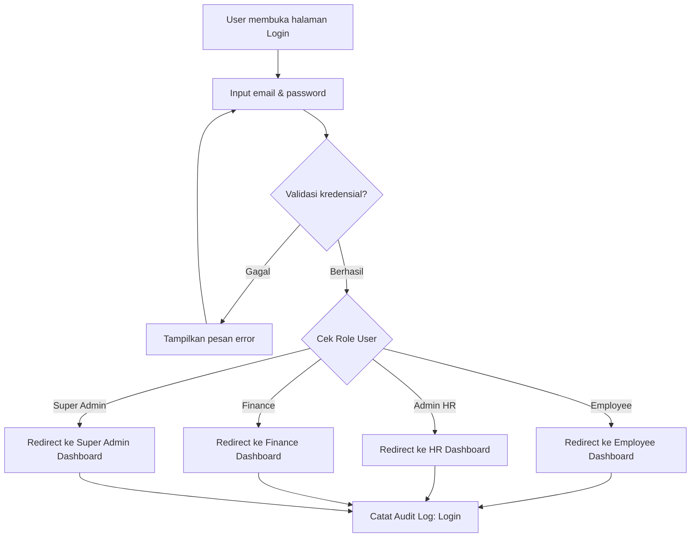
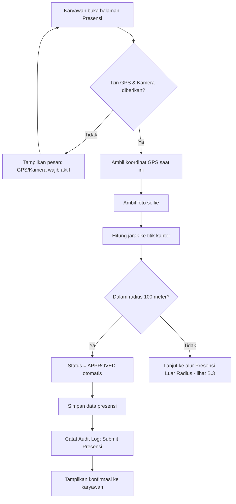
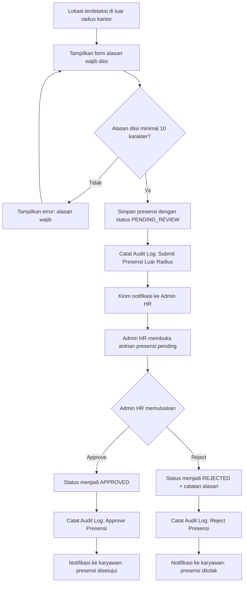
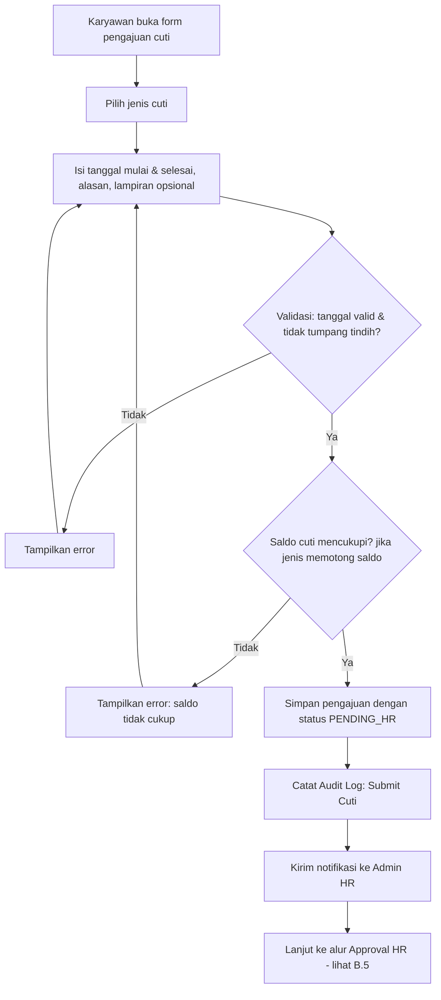
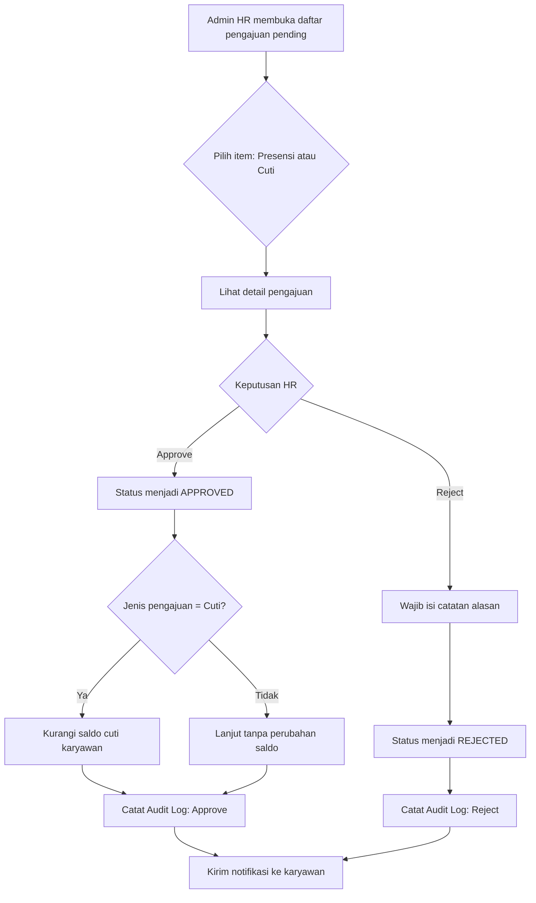
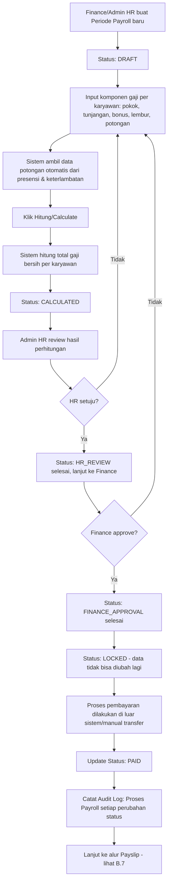
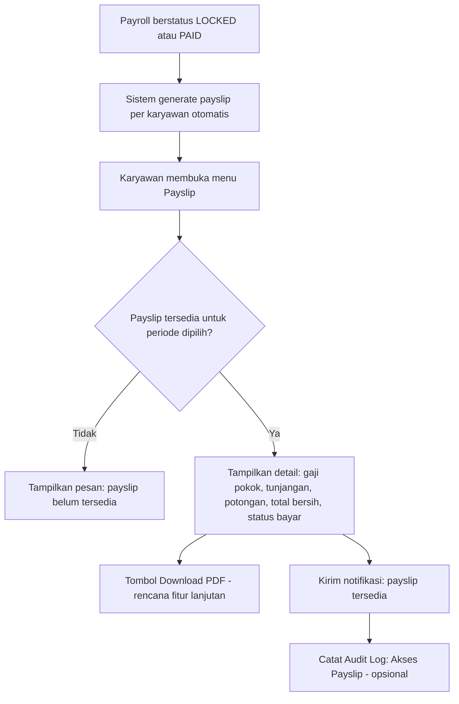
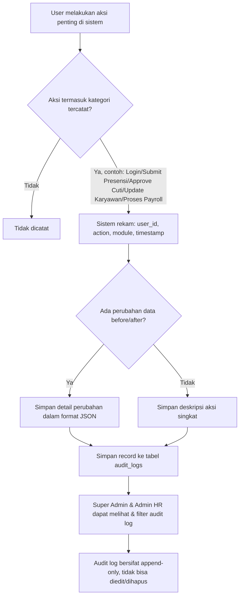

# 02. Flowchart — HRIS Mobile App

Seluruh flowchart menggunakan format **Mermaid**. Render di GitHub, VS Code (extension Markdown Preview Mermaid Support), atau https://mermaid.live

### B.1 Alur Login dan Role Redirect

### B.2 Alur Presensi GPS + Selfie

### B.3 Alur Presensi di Luar Radius

### B.4 Alur Pengajuan Cuti/Izin

### B.5 Alur Approval HR (Presensi & Cuti)

### B.6 Alur Payroll

> Status note: alur ini adalah rancangan historis payroll internal. Setelah Phase 28 direvert, final payroll calculation/payment akan ditangani external payroll system. HRIS berperan sebagai source of truth employee data dan attendance, lalu menerima payroll/payslip results dari sistem eksternal.

### B.7 Alur Payslip

### B.8 Alur Audit Log

